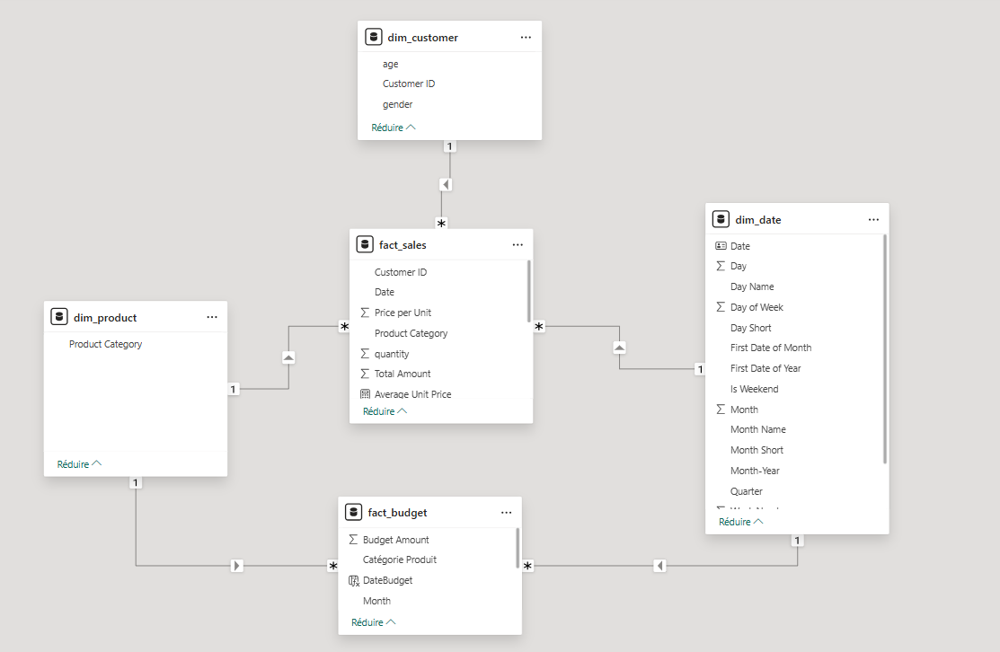
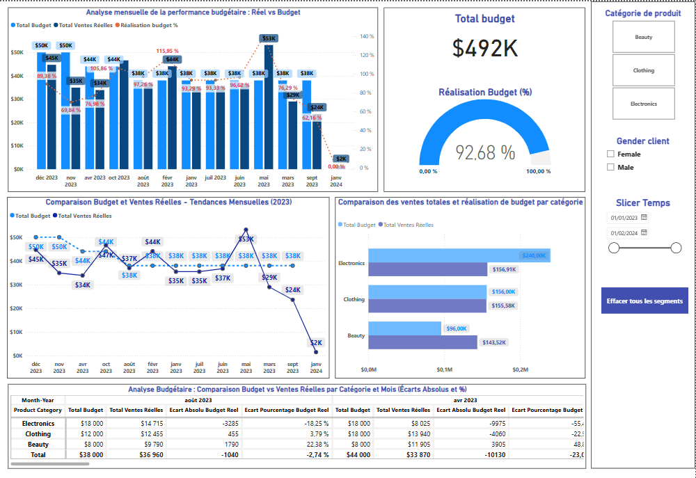
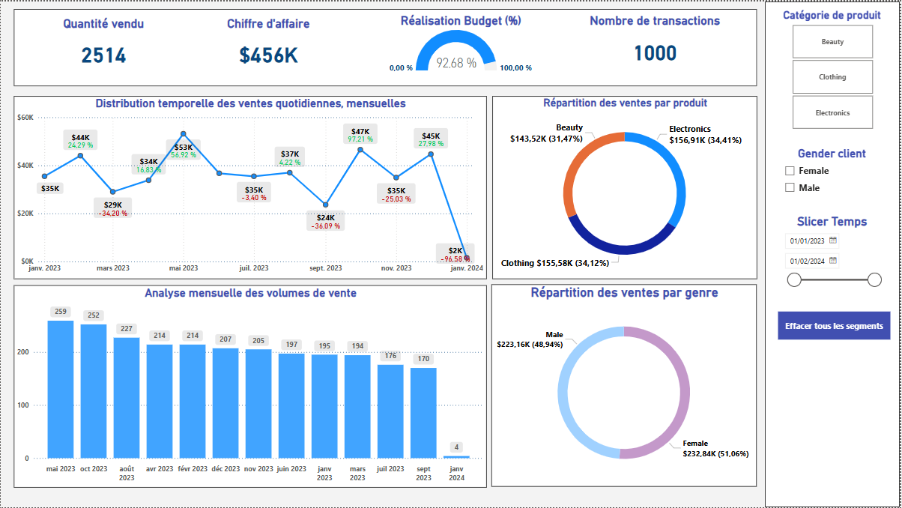

# 📊 Presentation 13 – Power BI : Analyse des ventes et Budget

## 👤 Réalisé par :
Hafsa AIT EL ATIK - Chaimaa ELQOUBAA 
Encadré par : Pr.Lotfi Najdi

---

## 🎯 Objectif du projet

Créer un tableau de bord interactif Power BI basé sur un jeu de données réels pour analyser :

- Les ventes au détail
- Le comportement des clients
- Les écarts entre le budget prévisionnel et les ventes réelles

---

## 🧱 Architecture utilisée

- **Source des données** : CSV Retail Sales Dataset (Kaggle)
- **ETL** : Pentaho Data Integration (fichier `.ktr`)
- **Stockage** : PostgreSQL (mode Import dans Power BI)
- **Outil BI** : Power BI Desktop

---

## 🗂️ Dossier contient :

| Fichier | Description |
|--------|-------------|
| `rapport_avancement.pdf` | Document PDF résumant les étapes |
| `Presentation_PowerBI_Hafsa.pptx` | Présentation PowerPoint |
| `Retail_Sales_Dashboard.pbix` | Rapport Power BI complet |
| `assets/` | Dossier avec captures d’écran |
| `dataset/` | Dataset original (CSV utilisé) |
| `pentaho_etl/` | Script ETL Pentaho (`.ktr`) |

---

## 📌 Phases du projet

### 🔹 Phase 1 – Analyse des ventes réelles
- Intégration via Pentaho
- Modélisation en étoile (fact_sales, dim_customer, dim_product, dim_date)
- Création de mesures DAX (Total Sales, Quantity Sold, etc.)
- Visualisations : KPI, courbes, barres, filtres

### 🔹 Phase 2 – Budget vs Réel
- Intégration des données budgétaires
- Mesures de comparaison (% de réalisation)
- Graphiques d’écart entre le budget et le réalisé

### 🔹 Phase 3 – (Limité à aperçu)
- Narration personnalisée (Smart Narrative simplifiée)
- Q&A (Questions-Réponses Power BI)

---

## 🔗 Dataset utilisé

[Retail Sales Dataset on Kaggle](https://www.kaggle.com/datasets/mohammadtalib786/retail-sales-dataset/data)

---

## 📷 Aperçu

  

---

## 🙏 Remerciements

Ce projet a été réalisé sous la supervision de **M. Lotfi Najdi**, que nous remercions chaleureusement pour son encadrement et ses conseils.
